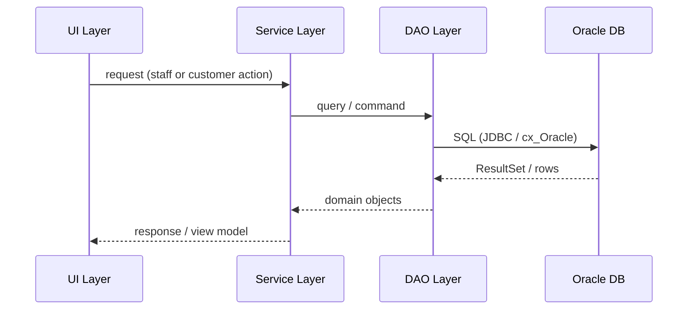
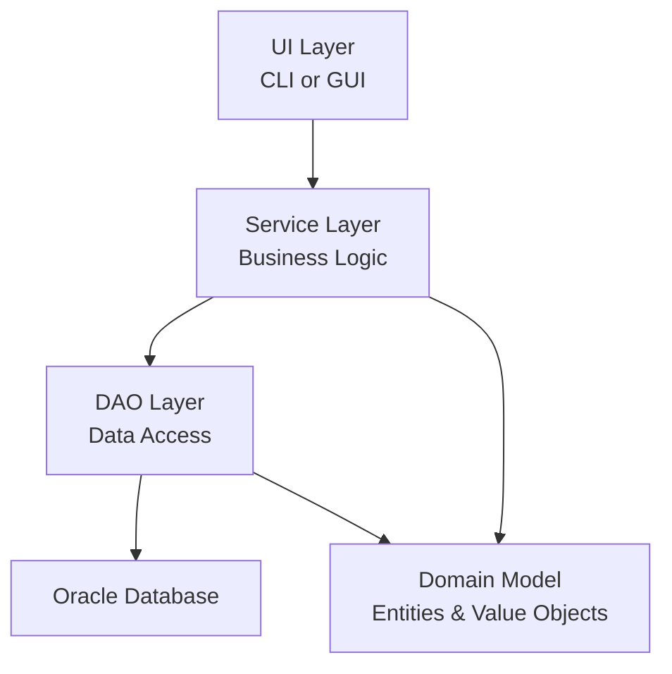
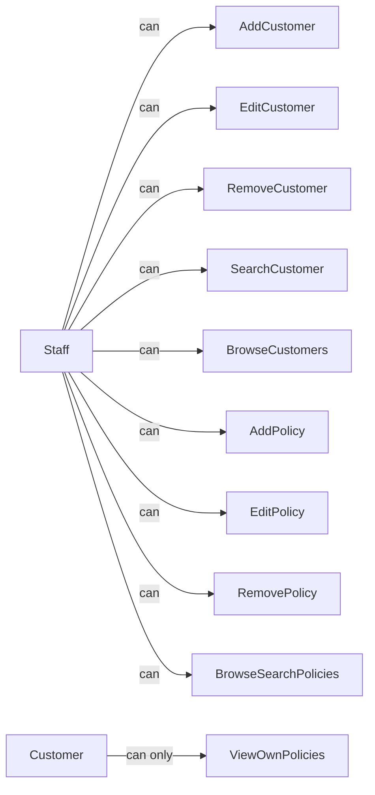

# InsuranceCompanyDatabase
Final Project for database design


# Design Document: Insurance Company Management System

## Overview

A multi-user insurance management system for CMPSC 430 Spring 2026 Project A. The system manages home, car, and life insurance policies for customers, backed by an Oracle database, with a Python application layer.

## Main Workflow



## Architecture



## Package / Module Organization

The project follows a layered architecture. The top-level source root is `src/` (Java) or `src/` (Python package root).

```
insurance-management-system/
├── src/
│   ├── domain/                  # Pure entity classes — no DB, no UI
│   │   ├── Customer             # Customer entity
│   │   ├── HomeInsurance        # Home policy entity
│   │   ├── CarInsurance         # Car policy entity
│   │   └── LifeInsurance        # Life policy entity
│   │
│   ├── dao/                     # Data Access Objects — all SQL lives here
│   │   ├── CustomerDAO          # CRUD + search for customers
│   │   ├── HomeInsuranceDAO     # CRUD + search for home policies
│   │   ├── CarInsuranceDAO      # CRUD + search for car policies
│   │   ├── LifeInsuranceDAO     # CRUD + search for life policies
│   │   └── DBConnection         # Oracle connection factory / pool
│   │
│   ├── service/                 # Business logic, validation, orchestration
│   │   ├── CustomerService      # Staff operations on customers
│   │   ├── InsuranceService     # Policy operations (all three types)
│   │   └── AuthService          # Role differentiation (staff vs customer)
│   │
│   ├── ui/                      # Presentation layer (CLI and/or GUI)
│   │   ├── cli/                 # Command-line interface menus
│   │   │   ├── StaffMenu        # Staff operations menu
│   │   │   └── CustomerMenu     # Customer view menu
│   │   └── gui/                 # Optional GUI (JavaFX / Tkinter)
│   │       ├── StaffView        # Staff GUI screens
│   │       └── CustomerView     # Customer GUI screens
│   │
│   └── Main                     # Application entry point
│
├── db/                          # Database artifacts (no application code)
│   ├── er_diagram/              # ER diagram files (PNG, PDF, etc.)
│   ├── schema/                  # DDL scripts (CREATE TABLE, constraints)
│   └── seed/                    # Sample / test data INSERT scripts
│
├── docs/                        # Project documentation
│   ├── requirements/            # Assignment spec, requirements docs
│   └── design/                  # Design diagrams
│
└── tests/                       # Test cases
    ├── unit/                    # Unit tests per service/DAO
    └── integration/             # DB integration tests
```

## Core Interfaces / Types

### Domain Entities

```pascal
STRUCTURE Customer
    customer_id             : Integer  {PK, auto-generated}
    first_name              : String
    last_name               : String
    date_of_birth           : Date
    phone_number            : String
    email                   : String
    street                  : String
    city                    : String
    state                   : String
    apartment_number        : String
    zipcode                 : String
END STRUCTURE


STRUCTURE Policy
  policy_id               : Integer  {PK, auto-generated}
  customer_id             : Integer  {FK → Customer}
  monthly_payment         : Decimal
  start_date              : Date
  coverage                : Decimal
END STRUCTURE


STRUCTURE HomeInsurance
  house_id                : Integer  {PK, auto-generated}
  policy_id               : Integer  {FK → Policy}
  end_date                : Date
  house_price             : Decimal
  house_area              : Decimal
  bedroom_number          : Integer
  bathroom_number         : Integer
  street                  : String
  city                    : String
  state                   : String
  apartment_number        : String
  zip_code                : String
END STRUCTURE


STRUCTURE CarInsurance
  car_id                  : Integer  {PK, auto-generated}
  policy_id               : Integer  {FK → Policy}
  end_date                : Date
  make                    : String
  model                   : String
  vin                     : String  {unique}
  yearly_mileage          : Integer
END STRUCTURE


STRUCTURE LifeInsurance
  life_id                 : Integer  {PK, auto-generated}
  policy_id               : Integer  {FK → Policy}
  existing_conditions     : String
  beneficiary             : String
END STRUCTURE

```

### DAO Interface Contracts

```pascal
INTERFACE CustomerDAO
  PROCEDURE addCustomer(c : Customer) → void
  PROCEDURE updateCustomer(c : Customer) → void
  PROCEDURE removeCustomer(customerId : Integer) → void
  PROCEDURE findCustomerById(customerId : Integer) → Customer
  PROCEDURE searchCustomers(query : String) → List<Customer>
  PROCEDURE getAllCustomers() → List<Customer>
END INTERFACE


INTERFACE PolicyDAO
  PROCEDURE addPolicy(p : Policy) → void
  PROCEDURE updatePolicy(p : Policy) → void
  PROCEDURE removePolicy(policyId : Integer) → void
  PROCEDURE findPolicyById(policyId : Integer) → Policy
  PROCEDURE getPoliciesByCustomer(customerId : Integer) → List<Policy>
END INTERFACE

INTERFACE InsurancePolicyDAO  {shared contract for all three types}
  PROCEDURE addPolicy(policy : Policy) → void
  PROCEDURE updatePolicy(policy : Policy) → void
  PROCEDURE removePolicy(policyId : Integer) → void
  PROCEDURE findPolicyById(policyId : Integer) → Policy
  PROCEDURE searchPolicies(query : String) → List<Policy>
  PROCEDURE getAllPolicies() → List<Policy>
  PROCEDURE getPoliciesByCustomer(customerId : Integer) → List<Policy>
END INTERFACE
```

### Service Interface Contracts

```pascal
INTERFACE CustomerService
  PROCEDURE addCustomer(data : CustomerInput) → Result
  PROCEDURE editCustomer(customerId : Integer, data : CustomerInput) → Result
  PROCEDURE removeCustomer(customerId : Integer) → Result
  PROCEDURE searchCustomer(query : String) → List<Customer>
  PROCEDURE browseCustomers() → List<Customer>
END INTERFACE


INTERFACE InsuranceService
  PROCEDURE addPolicy(type : PolicyType, data : PolicyInput) → Result
  PROCEDURE editPolicy(policyId : Integer, data : PolicyInput) → Result
  PROCEDURE removePolicy(policyId : Integer) → Result
  PROCEDURE browseAllPolicies(type : PolicyType) → List<Policy>
  PROCEDURE searchPolicies(type : PolicyType, query : String) → List<Policy>
  PROCEDURE getCustomerPolicies(customerId : Integer) → List<Policy>
END INTERFACE
```

## Role-Based Access



## Testing Strategy

### Unit Testing
- Test each `Service` method in isolation using mock DAOs
- Cover: valid input, missing fields, duplicate records, not-found cases

### Integration Testing
- Test each `DAO` against a live Oracle test schema
- Verify INSERT, UPDATE, DELETE, SELECT round-trips for all four entities

### Property-Based Testing
- Property: `addCustomer` followed by `findCustomerById` always returns the same data
- Property: `removeCustomer` followed by `findCustomerById` always returns null/not-found
- Property: `getPoliciesByCustomer` never returns policies belonging to a different customer

